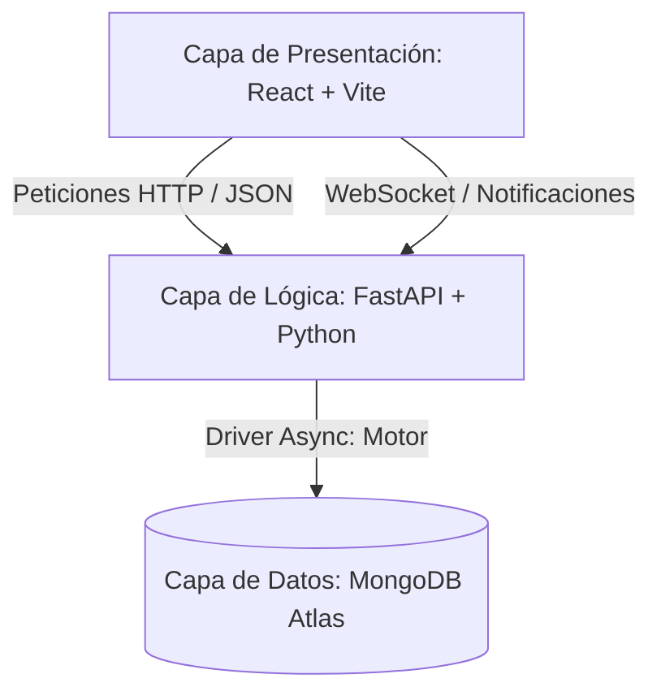

# Documentación Técnica Unificada — Kanbix

> Fuente de verdad consolidada y actualizada para la arquitectura, modelo de datos, diseño técnico e implementación del sistema Kanbix.

---

## 1. Contexto del Proyecto

**Curso:** Arquitectura y Evolución de Software  
**Metodología:** Spec-Driven Development (SDD)  
**Stack Principal:** React + TypeScript + Vite (Frontend) · FastAPI + Python (Backend) · MongoDB Atlas (Base de Datos)

### Problemática y Objetivos
Kanbix aborda la necesidad de los equipos de desarrollo de contar con una herramienta ágil y unificada de gestión (Kanban + sprints + alertas + reportes en tiempo real) construida sobre especificaciones formales y contratos estrictos de API. Esto elimina la brecha común entre el diseño de arquitectura y la codificación final.

---

## 2. Arquitectura de Software

El sistema está diseñado bajo el patrón **Cliente-Servidor** y una **Arquitectura en Capas (Layered Architecture)**, con comunicación guiada estrictamente por contratos OpenAPI (FastAPI) y tipos estáticos en TypeScript.



### Capas del Sistema

| Capa | Ubicación | Tecnologías | Responsabilidad |
| :--- | :--- | :--- | :--- |
| **Presentación** | `kanban-frontend` | React 18, TypeScript, Vite, CSS Vanilla, Recharts | Renderizado de vistas, componentes UI reutilizables, hooks de estado y comunicación HTTP (Axios). |
| **Lógica de Negocio** | `kanban-backend` | FastAPI, Python 3.12, Pydantic | Controladores de negocio, validaciones y esquemas de datos (Pydantic), y autenticación (JWT). |
| **Datos** | `kanban-backend` | MongoDB Atlas, Motor (driver async) | Definición de colecciones, consultas asíncronas y agregación de métricas. |

### Organización del Código (Patrones de Slicing)

* **Backend (Vertical Slicing):**  
  Cada módulo en `app/modules/<nombre_modulo>/` es autocontenido e independiente, compuesto por:
  - `routes.py` (Endpoints y dependencias de FastAPI)
  - `controller.py` (Intermediario entre rutas y lógica de negocio)
  - `service.py` (Lógica de negocio y consultas a base de datos)
  - `model.py` (Definición estructural de documentos)
  - `schemas.py` (Modelos Pydantic para validación de entrada/salida)
  
  *Regla:* Prohibido importar código directamente entre módulos. La comunicación inter-módulo se realiza mediante llamadas de API.
  
* **Frontend (Feature Slicing):**  
  Cada característica reside en `src/features/<nombre_feature>/`, con carpetas internas:
  - `pages/` (Vistas completas)
  - `components/` (Componentes exclusivos de la vista)
  - `hooks/` (Lógica de estado y hooks custom)
  - `api/` (Llamadas Axios exclusivas del módulo)
  
  *Regla:* Prohibido realizar importaciones directas cruzadas entre características (`features/X` no importa de `features/Y`). Componentes comunes residen en `src/shared/`.

---

## 3. Estructura de Datos (MongoDB Atlas)

Kanbix utiliza MongoDB Atlas como motor de base de datos no relacional, ideal para la representación anidada de proyectos, tableros y tareas.

### Colecciones Principales y Esquema

```
users (Colección de Usuarios)
├── _id: ObjectId
├── email: string (único)
├── password_hash: string
├── nombre_completo: string
├── rol_global: "Admin" | "Manager" | "Developer"
├── cambiar_password: boolean (primer login obligado)
├── password_updated_at: datetime
├── password_history: array of strings (últimos 5 hashes)
└── intentos_fallidos / cuenta_bloqueada / bloqueado_hasta

projects (Colección de Proyectos)
├── _id: ObjectId
├── name / nombre: string (único)
├── description / descripcion: string
├── color: string (código hexadecimal)
├── estado: "Activo" | "Pausado" | "Archivado"
├── id_creador: ObjectId | string
├── created_at: datetime
├── updated_at: datetime
└── members (Array de miembros asignados)
    └── user_id: ObjectId
    └── rol: "Manager" | "Developer" | "Viewer"

boards (Colección de Tableros)
├── _id: ObjectId
├── project_id: ObjectId
└── columns (Array de columnas asociadas)
    ├── _id: ObjectId
    ├── name: string
    └── order: int
```

---

## 4. Módulos y Responsabilidades del Sistema

### Mapeo de Módulos

| # | Módulo | Backend Path | Frontend Path | Contrato API |
|---|---|---|---|---|
| 1 | Auth & Usuarios | `app/modules/auth/` | `src/features/auth/` | `docs/contratos/modulo1_auth_usuarios.md` |
| 2 | Proyectos & Equipos | `app/modules/projects/` | `src/features/projects/` | `docs/contratos/modulo2_proyectos.md` |
| 3 | Tableros & Tareas | `app/modules/boards/` | `src/features/kanban/` | `docs/contratos/modulo3_tableros_tareas.md` |
| 4 | Planificación & Asignación | `app/modules/planning/` | `src/features/planning/` | `docs/contratos/modulo4_planificacion.md` |
| 5 | Alertas & Notificaciones | `app/modules/notifications/` | `src/features/notifications/` | `docs/contratos/modulo5_notificaciones.md` |
| 6 | Reportes & Dashboard | `app/modules/reports/` | `src/features/reports/` | `docs/contratos/modulo6_reportes.md` |
| 7 | Consola de TI & Admin | `app/main.py` | `src/features/projects/pages/` | `docs/requerimientos/requerimientos_funcionales.md` |

---

## 5. Implementación de Casos Clave y Evolución del Sistema

### A. Autenticación y Cambio Obligado de Contraseña (Módulo 1)
* **Primer Inicio de Sesión Obligatorio:** Implementado según `RN-31`. El token JWT incluye la bandera `cambiar_password`.
* **Seguridad de Contraseñas:** Se valida contra las últimas 5 contraseñas históricas (`password_history`) y expira cada 90 días (`password_updated_at`).
* **Mejora de UX:** La vista de cambio de contraseña (`ChangePasswordPage.tsx`) se rediseñó con un tema claro premium, ojo reactivo de contraseña y un inicio de sesión inmediato automático tras actualizar su contraseña sin requerir desloguearse.

### B. Asistente de Proyectos en Dos Pasos (Módulo 2)
* **Modal Asistente:** Rediseñado en `ProjectsPage.tsx` como un flujo de dos fases:
  1. *Paso 1:* Nombre, descripción y color identificador.
  2. *Paso 2:* Asignación de miembros mediante una tabla que lista usuarios con roles globales de `Manager` y `Developer`.
* **Portal de React:** El modal se renderiza en el `document.body` mediante `createPortal` para evitar cortes en el layout y problemas de superposición. El fondo tiene bloqueado el cierre accidental por clics.
* **Exclusión de Creador:** El creador del proyecto es asignado automáticamente como `Manager` en el backend, por lo que se le excluye dinámicamente de la lista del modal del paso 2.

### C. Consola de TI y Administración Global (Módulo 7)
* **Bypass de Permisos:** El rol global `Admin` (TI) puede listar todos los proyectos creados en el sistema sin importar su membresía (bypass en `service.py`), y eliminarlos en cascada de manera irreversible.
* **Inhibición de Componentes Operativos:** Al iniciar sesión como `Admin`, la cabecera (navbar) oculta la barra de búsqueda global y las notificaciones, sustituyéndolas por el badge del **Panel de TI**. El hook de atajos globales de teclado también se bloquea para este rol.
* **Estado del Sistema con Pings Activos:** Migrado desde la página de ayuda del usuario común. Cuenta con un monitoreo en tiempo real que realiza pings HTTP al backend (`/api/v1/health`) calculando la latencia del API y la base de datos MongoDB Atlas de manera dinámica.
* **Modal de Borrado Personalizado:** Reemplaza al confirm nativo del navegador con una confirmación elegante en React que advierte la destrucción en cascada de sprints, tableros y tareas asociadas.

---

## 6. Decisiones de Arquitectura (ADRs)

* **ADR-001 (SDD):** El desarrollo de código está estrictamente precedido por la especificación y revisión de contratos de API.
* **ADR-002 (JWT & Refresh):** Doble token para mantener sesiones seguras y transparentes al usuario, manejando solicitudes de refresco concurrentes mediante cola de suscriptores en frontend.
* **ADR-003 (MongoDB):** Flexibilidad de esquemas para manejar la jerarquía de proyectos y tableros.
* **ADR-004 (WebSockets):** Notificaciones instantáneas reactivas escuchando directamente Change Streams en MongoDB.
* **ADR-005 (FastAPI):** Stack asíncrono de alto rendimiento y autogeneración de contratos OpenAPI.
* **ADR-006 (Fibonacci):** Escala de estimación ágil unificada (1, 2, 3, 5, 8, 13, 21) para story points.
